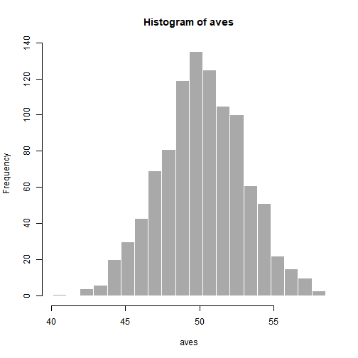

Pitch_presentation
========================================================
author: Bopeng Zhang
date: 09/11/2017
autosize: true

Introduction
========================================================
This is a presentation for the project done for Coursera course "Developing Data Products"
### The app developed is a simple one but fullfill requirements to include:
- Some form of input (widget: textbox, radio button, checkbox, ...)
- Some operation on the ui input in sever.R
- Some reactive output displayed as a result of server calculations


Ideas
========================================================

- As a simple simulation project to illustrate how the 'central limit theorem' is played out, users can vary the amount of random numbers and the way to display stats in histograms

- Settings: random numbers are in the range of 0 to 100, therefore, expected to have a mean around 50.


Implementation
========================================================

A sample code in server.R is shown here to demonstrate the implementation of the simulatin.


```r
aves <- c()
    times <- 100 # an input from ui.R
    for (i in 1:1000){
      x    <- mean(runif(times, min=0, max=100))
      aves <- c(aves, x)
    }
```

Slide With Plot
========================================================

A typical histogram output will be display in the main panel in the shiny app.


